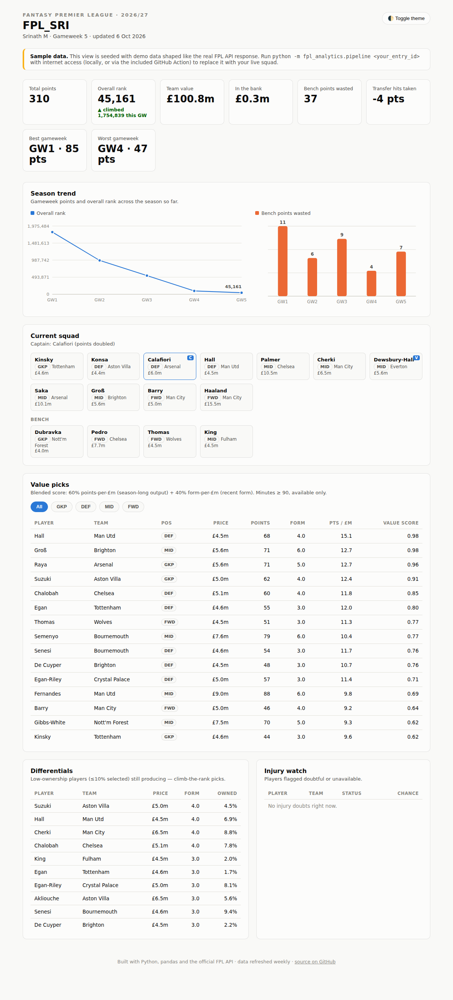
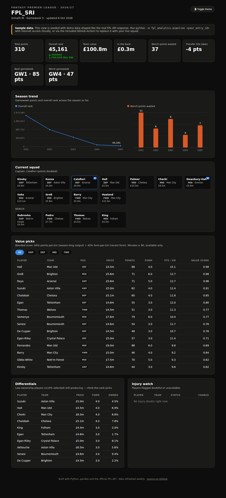

# FPL Analytics Dashboard

A weekly data pipeline and interactive dashboard for Fantasy Premier League —
pulls live data from the official FPL API, cleans and analyzes it with
Python/pandas, and publishes an interactive squad tracker + value-pick
explorer. Runs itself on a schedule via GitHub Actions.

**Live dashboard:** _add your GitHub Pages URL here after the first deploy
(Settings → Pages, once the `update_data` workflow has run once)._


<details>
<summary>Dark mode</summary>


</details>

## What it does

- **Squad tracker** — points and overall-rank trend across the season,
  bench points left on the table each gameweek, transfer-hit cost, current
  XI + bench with the captain flagged.
- **Value-pick analytics** — a blended points-per-£m / form-per-£m score,
  filterable by position, plus a differentials table (low-ownership players
  still producing) and an injury-watch list.
- Refreshes itself automatically: a scheduled GitHub Action re-runs the
  pipeline, commits the new data, and redeploys the dashboard — no manual
  step required once it's set up.

## Workflow

```
Datenabruf          Bereinigung         Analyse              Visualisierung       Publikation
(fetch.py)    ->    (clean.py)    ->    (metrics.py,   ->    (dashboard/     ->   (GitHub Pages,
official FPL         raw JSON ->         squad.py)            index.html,          GitHub Actions,
API, no auth          tidy pandas        value scores,         inline SVG           weekly cron)
needed                 DataFrames         rank trend,           charts, no
                                           bench waste           chart library)
```

Each stage is its own module so it can be tested and reused independently:

```
src/fpl_analytics/
├── fetch.py      # HTTP calls to the official FPL API (bootstrap-static,
│                 #   fixtures, entry history, entry picks, transfers)
├── clean.py      # raw JSON -> tidy pandas DataFrames
├── metrics.py    # value-pick scoring, differentials, injury watch
├── squad.py      # season summary, rank trend, bench-waste tracking
└── pipeline.py   # orchestrates the four stages, exports dashboard.json
```

## Tech stack

Python · pandas · requests · pytest · vanilla JS/SVG (no chart library,
so the dashboard is a single dependency-free static page) · GitHub Actions ·
GitHub Pages.

## Running it yourself

```bash
git clone <this-repo-url>
cd fpl-analytics
pip install -e .

# find your entry ID: open your team on fantasy.premierleague.com,
# it's the number in the URL — fantasy.premierleague.com/entry/<id>/event/<gw>
python -m fpl_analytics.pipeline <your_entry_id>

# serve the dashboard locally
python -m http.server --directory dashboard 8000
# open http://localhost:8000
```

That writes `data/processed/dashboard.json` (+ CSVs for Excel) and mirrors
it to `dashboard/data/dashboard.json`, which the dashboard reads directly —
no backend needed.

### Running the tests

```bash
pip install pytest
pytest tests/ -v
```

### Automating it (GitHub Actions)

1. Push this repo to GitHub.
2. **Settings → Secrets and variables → Actions → Variables** — add
   `FPL_ENTRY_ID` set to your entry ID.
3. **Settings → Pages** — set Source to "GitHub Actions".
4. Run the **"Update FPL data & deploy dashboard"** workflow once manually
   (Actions tab → select it → "Run workflow") to generate the first live
   deploy. After that it runs weekly on its own (Tuesdays, 06:00 UTC —
   adjust the cron in `.github/workflows/update_data.yml` if you'd rather
   it ran right after your gameweek deadline).

### Demo data

This repo ships with sample data (`scripts/generate_demo_data.py`) so the
dashboard works out of the box before you've connected a real entry ID —
you'll see a "Sample data" banner until you run the pipeline for real.
Regenerate it with:

```bash
python scripts/generate_demo_data.py
python -c "from fpl_analytics import pipeline; pipeline.run_from_raw(<entry_id>)"
```

## Power BI report

The pipeline also writes a Power BI-ready star schema to `data/powerbi/`
(`dim_player`, `dim_team`, `dim_gameweek`, `fact_player_gw`, `fact_my_squad`,
`fact_my_gw`, `fact_team_fixture`). Everything needed to build the report is
in [`powerbi/`](powerbi/): Power Query loaders, DAX measures, a theme and a
step-by-step [build guide](powerbi/BUILD_GUIDE.md). The same tables work in
Tableau or Excel.

## Possible extensions

- Captaincy optimizer (expected points by fixture/form, ranked across your squad)
- Transfer suggestions weighted by your remaining budget and free transfers
- Mini-league comparison view
- Historical season-over-season trends once more data has accumulated

## License

MIT — do whatever you like with it.
